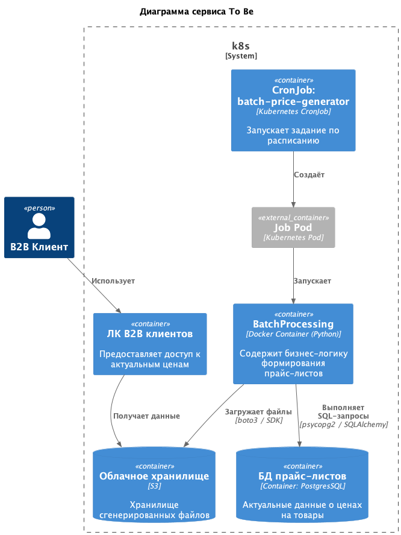

### **ADR: Генерация B2B‑прайс‑листов с использованием Kubernetes CronJob**

---

## **Контекст**
Каждое утро в 6:00 онлайн-магазин должен формировать индивидуальные прайс‑листы (CSV/XLS) для B2B‑клиентов на основе актуальных данных из базы данных PostgreSQL. Процесс выгрузки не требует сложной обработки — достаточно выполнить SQL‑запрос с соединением таблиц и сохранить результат в файл.

**Структура данных**
- Таблицы в PostgreSQL:
  - `products` – 5 000–10 000 строк
  - `categories` – 50–200 строк
  - `clients` – 100–500 строк
  - `client_prices` – 10 000–20 000 строк
- Итоговый объём данных в файле – 5 000–10 000 строк (после связывания).
- Инфраструктура – микросервисы, развёрнутые в облаке (Kubernetes).

**Функциональные требования**
- Ежедневный автоматический запуск в 6:00
- Генерация одного или нескольких файлов в формате CSV/XLS
- Сохранение файлов в доступное для клиентов хранилище (облачное объектное хранилище)

**Нефункциональные требования**
- Надёжность – задача должна выполняться каждый день без пропусков
- Масштабируемость – не требуется горизонтального масштабирования, но решение должно легко адаптироваться при росте объёмов в разумных пределах
- Интеграция с существующей микросервисной архитектурой

---

## **Решение**

Выбрано **Kubernetes CronJob** как основной механизм оркестрации, а в качестве языка реализации – **Python**.

### **Диаграмма системы To Be**

**Компоненты и интеграции**
- **Kubernetes CronJob** – обеспечивает запуск по расписанию, управление жизненным циклом подов, автоматическую очистку завершённых заданий
- **Контейнер с Python-приложением** – реализует всю бизнес‑логику: запрос к БД, генерацию файлов, сохранение в S3
- **PostgreSQL** – источник данных; доступ через стандартный драйвер, сетевое соединение внутри кластера
- **Облачное хранилище (S3)** – файлы выгружаются с ключом, включающим дату и идентификатор клиента, что обеспечивает изоляцию и возможность скачивания
- **ЛК B2B клиентов** - обеспечивает доступ к данным

---

## **Альтернативы**

| Критерий | Spring Batch | Apache Airflow | **K8s Job** | Spark |
|----------|--------------|----------------|-------------|-------|
| **Наличие конфигурации CRON‑расписания** | Через `@Scheduled` или внешний триггер | Встроенный CRON для DAG | Kubernetes CronJob (нативная поддержка) | Требуется внешний триггер (например, K8s CronJob) |
| **Сложность реализации логики обработки данных** | Низкая/средняя (готовые компоненты) | Средняя (DAG на Python) | **Низкая** (простой скрипт на Python/Java) | Высокая (избыточно для малых объёмов) |
| **Ресурсоёмкость** | Низкая (сотни МБ RAM постоянно) | Средняя (требует отдельной инфраструктуры) | **Низкая** (контейнер живёт только во время выполнения) | Высокая (требует кластера) |
| **Масштабируемость и сложность реализации** | Средняя (горизонтальное масштабирование через partition) | Высокая, но сложность настройки выше | **Масштабируется через K8s, но для задачи не требуется** | Высокая, но избыточная сложность |
| **Сложность развёртывания в облаке и интеграция с микросервисной архитектурой** | Низкая (как отдельный микросервис) | Средняя (требует установки Airflow) | **Низкая** (использует уже существующий K8s, единый стек) | Высокая (требует Spark‑оператора или отдельного кластера) |

---

## **Обоснование выбора технологий**

**Оркестрация: Kubernetes CronJob**
- **Нативная интеграция** – инфраструктура уже работает на Kubernetes, не нужно разворачивать дополнительные компоненты (Airflow, Spring Cloud Data Flow)
- **Простота** – манифест CronJob описывает всё необходимое: расписание, образ, переменные окружения, политику перезапуска
- **Ресурсоэффективность** – под запускается только на время выполнения задачи, ресурсы не потребляются в простое
- **Гибкость** – при необходимости можно быстро переключиться на разовый Job для отладки или изменить расписание

**Язык реализации: Python**
- **Быстрая разработка** – минимальный код, богатые библиотеки для работы с PostgreSQL, CSV, XLS, облачными хранилищами
- **Низкий порог входа** – команда знакома с Python, что упрощает поддержку
- **Лёгкий контейнер** – образ на основе `python:3.9-slim` занимает ~200 МБ, время запуска – секунды
- **Достаточная производительность** – для 10 000 строк pandas справляется мгновенно, дополнительная оптимизация не требуется

**Библиотеки**
- `psycopg2-binary` / `SQLAlchemy` – надёжное соединение с PostgreSQL
- `pandas` – удобное построение DataFrame и экспорт в CSV/XLS, поддержка больших объёмов
- `boto3` – стандартный клиент для AWS S3 (аналогичные библиотеки для других облаков)
- `python-dotenv` / `os` – чтение конфигурации из переменных окружения

---

## **Недостатки, ограничения, риски**

| **Категория** | **Описание** | **Способы смягчения / mitigation** |
|---------------|--------------|------------------------------------|
| **Отказоустойчивость** | Если под завершится с ошибкой (сбой БД, временная недоступность S3), задача не будет выполнена в этот день | Настроить `restartPolicy: OnFailure` и `backoffLimit` в Job. Дополнительно можно добавить повторный запуск при сбое через механизм `failedJobsHistoryLimit` |
| **Время выполнения** | При росте данных (например, до 500 000 строк) время выполнения может превысить ожидания, но в текущих условиях объём мал | Мониторинг времени выполнения; при необходимости можно добавить индексы в БД, оптимизировать запрос, перейти на стриминг данных (без pandas) |
| **Зависимость от облачного хранилища** | Недоступность S3 приведёт к сбою сохранения файлов | Использовать внутренний временный каталог, а затем повторные попытки загрузки с экспоненциальной задержкой. Настроить алерты на ошибки |
| **Безопасность** | Секреты (пароль БД, ключи S3) должны быть защищены | Использовать Kubernetes Secrets, монтировать как переменные окружения или том. Ограничить доступ к секретам |
| **Отсутствие панели управления** | Нет встроенного UI для мониторинга выполнения (в отличие от Airflow) | Натсроить централизованный сбор логов через ELK, экспорт метрик в Prometheus |
| **Долговечность исторических данных** | Файлы, сгенерированные ранее, могут быть случайно удалены из S3 | Настроить жизненный цикл объектов (например, хранить 30 дней). Дублировать файлы в другой bucket/регион при необходимости |
| **Масштабирование при резком росте** | Если количество клиентов вырастет до тысяч, генерация всех файлов в одном поде может занять много времени | Разбить генерацию на несколько параллельных Job |
