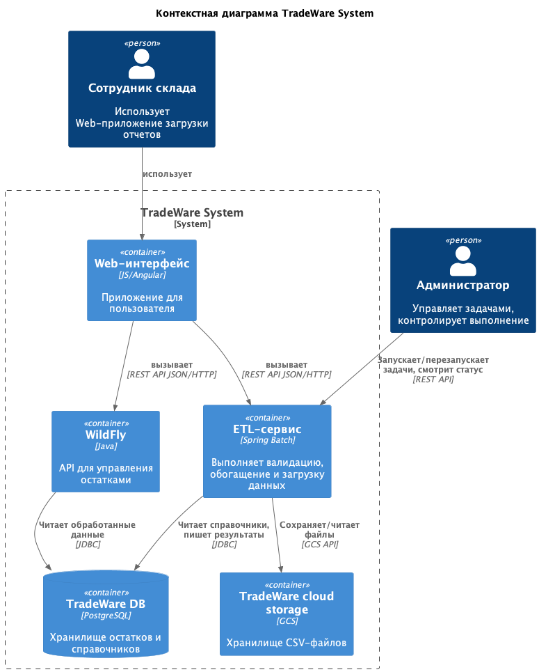

### **ADR-1: Выбор оркестратора ETL-операций и пакетной обработки данных**
### **Название задачи: Внедрение Spring Batch в качестве технологической основы для ETL-операций и пакетной обработки данных с целью разгрузки монолитного ядра, обеспечения масштабируемости и наблюдаемости.**
### **Функциональные требования**

| **№** | **Действующие лица или системы** | **Use Case** | **Описание** |
|:-|:-:|:-:|:-:|
| 1 | Сотрудник (ERP-система) | Загрузка CSV-файла остатков | Пользователь загружает файл через интерфейс ERP. Система принимает файл, помещает в GCS и инициирует задачу обработки |
| 2 | Spring Batch | Валидация формата | Чтение CSV-файла, проверка заголовков, типов данных, обязательных полей. При ошибках формируется отчёт и задача завершается с ошибкой |
| 3 | Spring Batch | Обогащение данными | Для каждой строки выполняется запрос к справочникам (акции, склады) для получения дополнительных атрибутов |
| 4 | Spring Batch | Загрузка в БД | Трансформированные данные сохраняются в результирующую таблицу PostgreSQL. Используется пакетная вставка (batch insert) |
| 5 | Администратор | Управление задачами | При дальнейшем развитии системы возможно использование Spring Cloud Data Flow. Через административный интерфейс можно просматривать историю, перезапускать упавшие задачи, настраивать расписание |
| 6 | Монолит (API) | Получение обработанных данных | После успешной загрузки монолитное приложение через REST API или прямое чтение из БД получает актуальные остатки для онлайн-запросов |

---

### **Нефункциональные требования**

| **№** | **Требование** |
|:-|:-:|
| 1 | **Производительность**: обработка отчёта на 2000 строк не должна превышать 30 секунд (включая чтение, обогащение, запись) |
| 2 | **Масштабируемость**: система должна выдерживать до 150 параллельных задач в пиковые часы без деградации производительности БД и других компонентов |
| 3 | **Наблюдаемость**: централизованный сбор логов, метрик (время выполнения, количество строк, статус) и трассировки для этапов обработки |
| 4 | **Совместимость**: интеграция с существующим стеком (Java 11, PostgreSQL, GCS, Docker) |
| 5 | **Гибкость**: архитектура должна позволять постепенное выделение сервисов из монолита и переход к микросервисной модели |

---

### **Решение**

#### **Архитектура: диаграмма контекста (C4)**

|**Категория**|**Пояснение**|
|:-|:-:|
|Соответствие стеку и экосистеме|Spring Batch – нативное решение для Java, не требует введения новых языков или сложных мостов|
|Гибкость масштабирования|Spring Batch позволяет выполнять задачи как в одном JVM (с пулом потоков), так и распределённо с помощью remote partitioning или integration с SCDF|
|Механизмы надёжности|Встроенные retry и skip-логики на уровне шагов, возможность сохранять состояние (Job Repository) и перезапускать упавшие задания с места сбоя|
|Наблюдаемость|Spring Batch предоставляет метрики через Micrometer, которые можно напрямую экспортировать в Prometheus. Логирование через SLF4J собирается в Fluentd -> ELK|
|Рефакторинг монолита|Выделение ETL в отдельный сервис на Spring Batch – первый шаг к декомпозиции монолита. В дальнейшем можно разбить по доменам: отдельный сервис для валидации, отдельный для обогащения, используя SCDF для оркестрации потоков данных|

---

### **Альтернативы**

| Технология | Описание | Плюсы | Минусы |
|:-|:-:|:-|:-|
| **Spring Batch** | Фреймворк на Java для пакетной обработки данных. | – Глубокая интеграция с Java-экосистемой, Spring Framework – Строгая типизация, тестируемость – Встроенные механизмы повторов и skip-логики | – Требует написания кода на Java/Kotlin, что увеличивает порог входа для дата-инженеров, привыкших к Python – Нет встроенного веб‑интерфейса для мониторинга и управления пайплайнами – Сложнее организовать ветвление, event‑триггеры и гибкую оркестрацию DAG‑зависимостей – Интеграции с BigQuery, Redshift, Kafka, Spark требуют кастомной реализации или использования сторонних библиотек |
| **Spring Cloud Data Flow (SCDF)** | Платформа для управления stream и batch приложениями на основе Spring Boot | - Надстройка над Spring Batch, предоставляющая UI, REST API, шедулинг - Поддержка развёртывания на Kubernetes, Cloud Foundry, локальных платформах - Интегрируется с мониторингом (Prometheus, Grafana) «из коробки» - Позволяет разбивать пайплайны на отдельные микроприложения (task) | - Требует дополнительной инфраструктуры (база данных для SCDF, возможно, Kafka для стримов) - Избыточен для начального этапа, если требуется просто запускать Spring Batch задания |
| **Apache Airflow** | Платформа оркестрации DAG на Python с богатой экосистемой провайдеров, веб‑интерфейсом и встроенными механизмами надёжности. | – Полностью соответствует требованиям – Готовые провайдеры для BigQuery, Redshift, Kafka, Spark – Гибкое описание пайплайнов на Python, мощный веб‑UI – Облачные управляемые версии снижают эксплуатационную нагрузку | – Требует отдельной инфраструктуры (метабаза, брокер сообщений, воркеры) – При очень большом количестве DAG планировщик может стать узким местом – Не предназначен для низколатентной потоковой обработки |

---

### **Недостатки, ограничения, риски**

1. **Сложность конфигурации** - Spring Batch требует тщательного проектирования шагов, транзакционных границ. Ошибки в конфигурации могут привести к снижению производительности или потере данных
2. **Управление памятью** - для больших файлов необходимо правильно настроить размер чанка (commit-interval) и использовать потоковую обработку, чтобы избежать OutOfMemoryError
3. **Отсутствие встроенного UI** - для мониторинга и управления заданиями потребуется либо разрабатывать собственную админку, либо внедрять SCDF, что добавит этап внедрения
4. **Риски миграции** - перенос существующей построчной логики из монолита в batch-процессы может потребовать рефакторинга и изменения схемы данных. Необходимо обеспечить консистентность во время перехода (двойная запись, feature toggles)
5. **Нагрузка на БД** - при 150 параллельных задачах, даже с пакетной записью, PostgreSQL может стать узким местом. Потребуется оптимизация (правильные индексы, возможно, партиционирование) и мониторинг пула соединений
6. **Обучение команды** - разработчики должны освоить Spring Batch (аннотации, ItemReader/Writer, транзакции). Это потребует времени и может замедлить первоначальную реализацию
